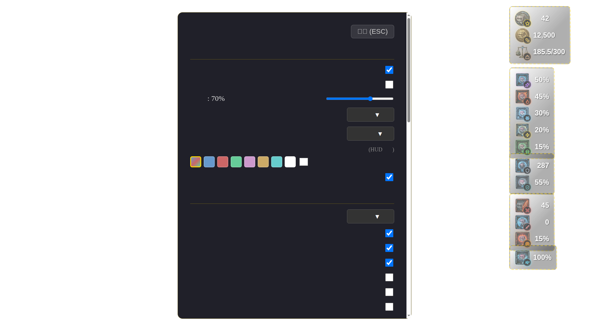

# Tullius Widgets

Skyrim SE용 전투 스탯 HUD 위젯 모드. [Prisma UI](https://www.nexusmods.com/skyrimspecialedition/mods/117592) 프레임워크 기반.


## Features

- **스탯 20종 표시**
  - 플레이어 정보: 레벨, 골드, 소지 무게, 체력, 매지카, 스태미나
  - 저항력: 마법, 화염, 냉기, 전기, 독, 질병
  - 방어: 방어도, 피해 감소율
  - 공격: 양손 공격력, 치명타 확률
  - 이동: 이동 속도
- **시간 위젯** — 스카이림 날짜/시간(4E 연도, 월 이름, 일, 시:분) + 현실 날짜/시간 표시
- **커스텀 아이콘** + 스탯 심볼 뱃지 오버레이
- **장착 슬롯 표시** — 오른손/왼손 장비(무기/마법/주문서/방패) 이름 표시
- **지속 버프/디버프 리스트** — 주문/포션 소스명 우선 + 효과명 + 남은 시간(초)을 인스턴스 단위로 동적 표시
- **드래그 배치** — 설정 패널에서 위젯 그룹을 자유롭게 드래그, 이웃 위젯에 자동 스냅


- **주기 동기화(Heartbeat)** — 이벤트가 없는 구간에도 짧은 주기로 스탯을 재동기화해 표기 정지/드리프트를 완화
- **값 변화 기반 표시 모드** — 설정에서 `값 변화 시에만 표시`를 켜면 최근 변경 후 N초 동안만 위젯 표시
- **런타임 진단 경고 배너** — 런타임/SKSE/Address Library 조합 이상 시 게임 내 경고 표시
- **첫 실행 온보딩 카드** — Insert/F11/표시 모드 핵심 사용법 안내
- **비네트 시각 알림** — 체력/매지카/스태미나 부족, 과적재 시 화면 가장자리 경고 효과
- **설정 패널** (Insert 키)
  - 위젯별 표시/숨김
  - 값 변화 표시 모드 + 표시 유지 시간(초)
  - 투명도, 크기, 레이아웃 (세로/가로)
  - 색상 톤 (자동 HUD 감지 or 수동)
  - 배경 투명 모드
  - 프리셋 내보내기/가져오기
- **게임 메뉴 자동 숨김** — 인벤토리, 지도, 제작 등 18종 메뉴 감지
- **한/영 다국어 지원**



## Requirements

- Skyrim SE (1.5.97 / 1.6.x)
- [SKSE64](https://skse.silverlock.org/)
- [Prisma UI](https://www.nexusmods.com/skyrimspecialedition/mods/117592)
- [Address Library for SKSE Plugins](https://www.nexusmods.com/skyrimspecialedition/mods/32444)

## Installation

1. [Releases](https://github.com/servaltullius/Tullius-Widgets/releases) 에서 `TulliusWidgets-v*.zip` 다운로드
2. zip 내용물을 `Skyrim Special Edition/Data/` 폴더에 복사
3. 게임 실행

설치 후 폴더 구조:
```
Data/
  SKSE/Plugins/TulliusWidgets.dll
  PrismaUI/views/TulliusWidgets/index.html
  PrismaUI/views/TulliusWidgets/assets/...
```

## Controls

| 키 | 동작 |
|----|------|
| `Insert` | 설정 패널 열기/닫기 |
| `F11` | 위젯 전체 표시/숨김 |
| `ESC` | 설정 패널 닫기 |
| 드래그 | 설정 패널 열린 동안 위젯 그룹 이동 |

## Release Notes Policy

- 릴리즈/프리릴리즈 제목: `Tullius Widgets v<version>`
- ZIP 산출물:
  - 기본(권장, CI 없이): `TulliusWidgets-v<version>.zip`
  - CI 아티팩트(선택): `TulliusWidgets-v<version>-ci.zip`
- ZIP 루트 구조: `SKSE/Plugins/...` + `PrismaUI/views/TulliusWidgets/...`
- 한국어 패치노트 파일: `docs/release-notes/<version>.ko.md`
- 로컬 릴리즈 스크립트(Windows): `pwsh -File .\scripts\release-local.ps1`
- 로컬 릴리즈 가이드: `docs/local-release.ko.md`
- 필수 섹션:
  - `## 변경 요약`
  - `## 사용자 영향/호환성`
  - `## 설치/업데이트 안내`

## 표시값 기준 (원본/실효 분리)

- 치명타 확률: 런타임 계산 `원본값`을 기반으로 `실효 표시 0% ~ 100%`로 출력
- 저항(마법/화염/냉기/전기/독): `원본값`은 별도 보조 텍스트로 표시, 실효값은 `-100% ~ 85%` 캡 적용
- 질병 저항: `원본값`/`실효값` 분리, 실효값은 `0% ~ 100%`
- 방어도/피해감소: 피해감소는 `80%` 캡 적용, 방어도는 `최대 효율 AR` 기준 보조 표기로 안내
- 오른손/왼손 공격력: 표시 안전 범위 `0 ~ 9999`

브릿지 payload 스키마 문서: `docs/stats-payload-schema.md`

## Building from Source

### Requirements
- Windows: Visual Studio 2022, [XMake](https://xmake.io/)
- WSL/Linux: Node.js 22+, npm

### Frontend
```bash
cd view
npm install
npm run build
```

### C++ SKSE Plugin (Windows MSVC 필수)
```bash
xmake f -p windows -a x64 -m release -y --skyrim_se=true --skyrim_ae=true --skyrim_vr=false
xmake build
```

### Packaging
```bash
# 권장 (Windows 로컬 빌드 + 패키징)
pwsh -File .\scripts\release-local.ps1 -NoPublish
# 결과: TulliusWidgets-v<version>.zip

# 대안 (WSL/Linux 스크립트)
./scripts/package.sh
# 결과: TulliusWidgets-v<version>.zip
```

### 값 이상치 트러블슈팅
- 치명타 확률이 `100%` 초과, 저항이 `85%` 초과로 보이면 구버전 DLL일 가능성이 큽니다.
- 최신 빌드는 내부 계산 후 다음 범위로 표시값을 제한합니다.
  - 치명타 확률: `0 ~ 100`
  - 마법/화염/냉기/전기/독 저항: `-100 ~ 85`
  - 질병 저항: `0 ~ 100`
  - 오른손/왼손 공격력: `0 ~ 9999`
- 로드 직후(또는 새 게임 직후) CTD가 난다면 `v1.1.3-rc.5` 이상으로 업데이트하고, 모드 매니저에서 구버전 `TulliusWidgets.dll` 중복 활성화를 해제하세요.

## Tech Stack

- **C++ SKSE Plugin** — C++23, [CommonLib-NG](https://github.com/CharmedBaryon/CommonLibSSE-NG), XMake
- **Frontend** — React 19, TypeScript, Vite, [lucide-react](https://lucide.dev/)
- **UI Framework** — [Prisma UI](https://www.nexusmods.com/skyrimspecialedition/mods/117592) (WebKit-based DX11 overlay)

## License

MIT
